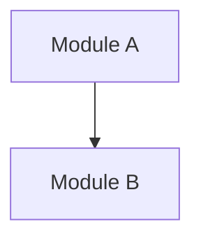

# System Context Report

**Generated Date**: {{DATE}}
**Analysis Target**: {{SCOPE}}

## Executive Summary
> [One sentence summary of the system's state, e.g., "A robust Python backend with some technical debt in the Auth module."]

---

## 1. Component Inventory

### 1.1 Existing Components
| Component | Type | Path | Description |
|---|---|---|---|
| [Name] | [Service/UI/DB] | [Path] | [Brief Desc] |

### 1.2 Missing Components (Dark Matter)
> [!WARNING]
> The following components are missing but critical for production readiness.

| Component | Category | Why Needed | Impact if Missing |
|---|---|---|---|
| Error Handling | Infrastructure | No central error boundary found | Debugging will be difficult |
| Logging | Observability | No structured logging | Blind in production |
| Config Mgmt | Ops | Hardcoded secrets detected | Security risk |

---

## 2. Dependency Topology

### 2.1 Build Boundaries (Build Inspector)
> [Insert findings from `build-inspector`: Build Roots, Topology, Sidecar Warnings]

### 2.2 Logical Coupling (Git Forensics)
> [Insert Hotspot Matrix or Coupling Table]

| File A | File B | Coupling | Risk |
|---|---|---|---|
| auth.py | user_db.py | 85% | HIGH |

---

## 3. Risks & Warnings

### 3.1 IPC Contract Risks (Runtime Inspector)
> [!CAUTION]
> [List IPC surfaces with weak/no contracts found by `runtime-inspector`]

### 3.2 God Modules
> [List modules with excessive Ca (Afferent Coupling)]

### 3.3 Tech Debt Hotspots
> [List files with High Churn + High Complexity]

---

## 4. Implicit Constraints (Invariant Hunter)

### 4.1 Business Invariants
> [Rules that must never be broken]
- Order total must be >= 0
- User must verify email before payment

### 4.2 Assumptions
> [Unwritten assumptions found in code]
- "Network is always reliable" (No retry logic)
- "ID is always an integer"

### 4.3 Hardcoded Values
- API Keys
- Timeout values

---

## 5. Conceptual Model (Concept Modeler)

### 5.1 Ubiquitous Language
| Term | Definition |
|---|---|
| User | A registered end-user (not an admin) |
| Order | A purchase request |

### 5.2 Data Flows
> [Describe key flows]

---

## 6. Human Checkpoints
> [!IMPORTANT]
> Please confirm the following before proceeding to Blueprint Phase:

- [ ] Is the Component Inventory complete?
- [ ] Are the identified Risks acceptable for now?
- [ ] Have all Invariants been captured?
