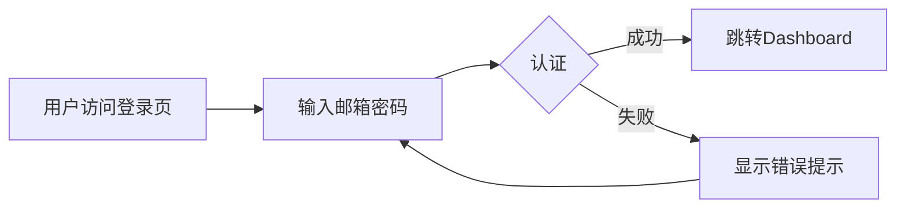

# Product Requirements Document (PRD) v2.0

**Project**: [Project Name]
**Title**: [Feature/Requirement Name]
**Status**: Draft | Review | Approved
**Version**: 1.0
**Author**: [Author Name or Agent]
**Date**: [YYYY-MM-DD]

---

## 1. Executive Summary
<!-- Context Compression: State the "Why" and "What" in < 50 words. -->
<!-- ⚠️ CRITICAL: This is the "elevator pitch". Must be < 50 words. -->

[Briefly describe the problem being solved and the proposed solution. Focus on value.]

---

## 2. Background & Context
<!-- ⭐ 新增: 提供充分背景，帮助后续System Design阶段理解 -->

### 2.1 Problem Statement (问题陈述)
- **Current Pain Point**: [用户面临的具体问题]
- **Impact Scope**: [受影响的用户群体/业务范围]
- **Business Impact**: [对业务的影响，如收入、用户满意度、效率]

### 2.2 Opportunity (机会)
[如果解决这个问题，能带来什么价值？定量描述]

### 2.3 Reference & Competitors (参考与竞品) - 可选
<!-- 了解市场已有解决方案，避免重复造轮子 -->
- **Competitor A**: [特点、优缺点]
- **Competitor B**: [特点、优缺点]
- **Our Differentiation**: [我们的独特价值]

---

## 3. Goals & Non-Goals

### 3.1 Goals
<!-- ⚠️ CRITICAL: 必须使用 SMART 原则 (Specific, Measurable, Achievable, Relevant, Time-bound) -->

- **[G1]**: [可衡量的目标，如: 用户登录成功率 > 95%]
- **[G2]**: [可衡量的目标，如: 页面加载时间 < 2s]

### 3.2 Non-Goals (Out of Scope)
<!-- Crucial for preventing scope creep -->

- **[NG1]**: [暂不考虑的功能，如: 第三方OAuth登录]
- **[NG2]**: [未来版本的考虑，如: 多因素认证]

---

## 4. User Stories (The "What")
<!-- Format: As a [User], I want to [Action], so that [Benefit] -->
<!-- ⚠️ CRITICAL: 每个User Story必须有唯一ID [REQ-XXX]，用于追溯链 -->

### US01: [Title] [REQ-001]
*   **Story**: As a [role], I want to [feature], so that [value].
*   **Acceptance Criteria (AC)**:
    *   [ ] **Given** [context], **When** [action], **Then** [outcome].
    *   [ ] **Error Case**: When [failure condition], show [specific error message].
*   **Priority**: P0 (Must Have) | P1 (Should Have) | P2 (Nice to Have)
*   **Estimation**: [Story Points 或 天数] - 可选

### US02: [Title] [REQ-002]
*   **Story**: ...
*   **Acceptance Criteria (AC)**:
    *   [ ] ...
*   **Priority**: P0/P1/P2

<!-- 继续添加更多User Stories... -->

---

## 5. User Experience & Design (用户体验) - 可选
<!-- ⭐ 新增: 描述关键的UX流程，帮助前端系统设计 -->

### 5.1 Key User Flows (关键用户流程)
<!-- 使用Mermaid流程图描述关键用户旅程 -->

### 5.2 Design Guidelines (设计规范)
- **UI Style**: [现代化、简洁、专业等]
- **Color Palette**: [主色调、辅助色]
- **Interactions**: [动画、反馈机制]

---

## 6. Constraint Analysis
<!-- Derived from /scout report or /challenge -->
<!-- ⭐ 增强: 分类更详细，便于后续System Design继承约束 -->

### 6.1 Technical Constraints (技术约束)
*   **Legacy Systems**: [e.g., Must work with existing Auth system]
*   **Performance**: [e.g., API response time < 200ms (p95)]
*   **Scalability**: [e.g., Support 100k concurrent users]

### 6.2 Security & Compliance (安全与合规)
*   **Security**: [e.g., No PII in logs, HTTPS only]
*   **Privacy**: [e.g., GDPR compliance]
*   **Compliance**: [e.g., SOC 2 Type II]

### 6.3 Time & Budget (时间与预算)
*   **Deadline**: [交付时间，如: 2026-03-01]
*   **Budget**: [预算限制] - 可选
*   **Team**: [团队规模和技能] - 可选

---

## 7. Success Metrics (成功指标)
<!-- ⭐ 新增: 如何衡量成功，便于后续验证 -->

| Metric | Target | Measurement Method |
|--------|--------|-------------------|
| 用户登录成功率 | > 95% | Google Analytics |
| 页面加载时间 (p95) | < 2s | Lighthouse/监控 |
| 用户满意度 (NPS) | > 4.5/5 | 用户调研 |

---

## 8. Definition of Done (完成标准)

*   [ ] All Acceptance Criteria (AC) passed.
*   [ ] Unit tests written and passing (coverage > 80%).
*   [ ] Integration tests passing.
*   [ ] No new lint errors.
*   [ ] Documentation updated (API docs, user manual).
*   [ ] Performance benchmarks met (if applicable).
*   [ ] Security audit passed (if applicable).
*   [ ] User acceptance testing (UAT) completed.

---

## 9. Appendix (附录) - 可选

### 9.1 Glossary (术语表)
- **[Term 1]**: [Definition]
- **[Term 2]**: [Definition]

### 9.2 References (参考资料)
- [Link 1]
- [Link 2]

### 9.3 Change Log (变更日志)
| Version | Date | Changes | Author |
|---------|------|---------|--------|
| 1.0 | 2026-01-08 | Initial version | XXX |

---

<!-- ⚠️ CRITICAL 使用指南 -->
<!-- 
**PRD撰写原则 (Amazon 6-pager风格)**:
1. **精炼至上**: 总长度最多6页（约3000-4000字）
2. **Executive Summary < 50字**: 电梯演讲
3. **每个User Story < 100字**: 简洁清晰
4. **数据驱动**: 所有目标和指标必须可衡量
5. **追溯链**: 每个User Story有唯一ID [REQ-XXX]

**章节使用指南**:
- **必需章节**: 1, 2.1, 3, 4, 6, 8
- **可选章节**: 2.3 (竞品分析), 5 (UX设计), 7 (成功指标), 9 (附录)
- **小项目**: 可省略 2.3, 5, 9，但结构保持一致
-->
