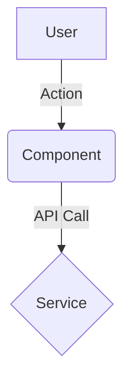

# Request for Comments (RFC) / Technical Spec

**PRD Reference**: [Link to PRD]
**Feature**: [Feature Name]
**Status**: Draft

## 1. High-Level Design
### Architecture Diagram (Mermaid)
<!-- Use Mermaid to show data flow -->


### Component Hierarchy
*   `ParentComponent`
    *   `ChildA` (Props: x, y)
    *   `ChildB` (State: z)

## 2. API Contract (The "Signature")
<!-- CRITICAL: Define exact signatures. No hallucination allowed. -->

### Endpoints
*   `POST /api/v1/resource`
    *   **Request Body**:
        ```typescript
        interface CreateRequest {
          field: string; // required
        }
        ```
    *   **Response**: `200 OK` (Schema below)

### Function Interfaces
<!-- Signatures for key internal functions -->
```typescript
function calculateSomething(input: InputType): ResultType
```

## 3. Data Model Strategy
### Database Schema Changes
```sql
-- DDL goes here
CREATE TABLE ...
```

### State Management
*   Global State: [e.g. Redux/Zustand slice]
*   Local State: [e.g. React.useState]

## 4. Implementation Steps
<!-- Atomic, ordered steps -->
1.  [Step 1: DB Migration]
2.  [Step 2: API Backend]
3.  [Step 3: Frontend UI]

## 5. Security & Risk
*   **Auth**: [How is this secured?]
*   **Validation**: [Input validation library?]
