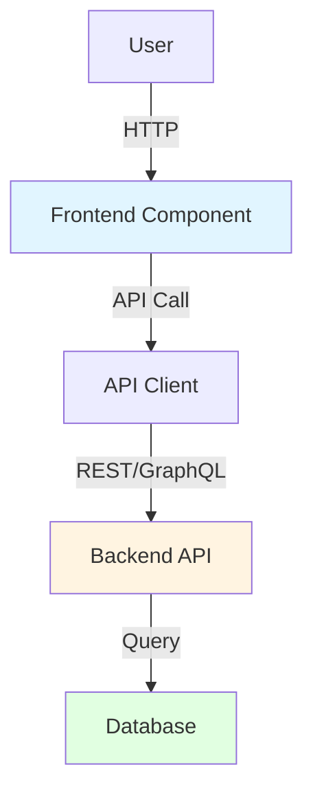
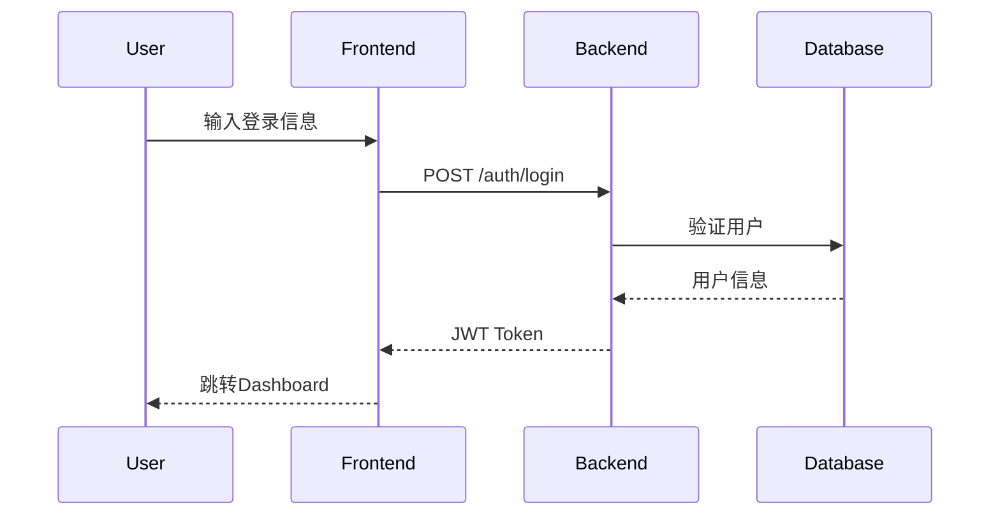

# {System Name} 系统设计文档

**System ID**: {system-id} (如: frontend-system, backend-api-system)
**Project**: [Project Name]
**Version**: 1.0
**Status**: Draft | Review | Approved
**Author**: [Author Name or Agent]
**Date**: [YYYY-MM-DD]

---

## 1. 概览 (Overview)

### 1.1 System Purpose (系统目的)
[这个系统要解决什么问题？为什么需要它？]

### 1.2 System Boundary (系统边界)
<!-- ⚠️ CRITICAL: 明确边界，避免职责不清 -->

- **输入 (Input)**: [系统接收什么？来自哪里？]
- **输出 (Output)**: [系统产出什么？给谁？]
- **依赖系统 (Dependencies)**: [依赖哪些其他系统？]
- **被依赖系统 (Dependents)**: [哪些系统依赖本系统？]

### 1.3 System Responsibilities (系统职责)
<!-- 明确"负责什么"和"不负责什么" -->

**负责**:
- [职责1]
- [职责2]

**不负责**:
- [非职责1 - 由XX系统负责]
- [非职责2 - 超出范围]

---

## 2. 目标与非目标 (Goals & Non-Goals)

### 2.1 Goals
<!-- 从PRD继承需求，转化为该系统的技术目标 -->

- **[G1]**: [该系统的具体目标，如: API响应时间p95 < 200ms]
- **[G2]**: [可衡量的性能/质量目标]

### 2.2 Non-Goals
- **[NG1]**: [不在本系统范围内的内容]

---

## 3. 背景与上下文 (Background & Context)

### 3.1 Why This System? (为什么需要这个系统？)
[问题背景、业务驱动、关联的PRD需求]

**关联PRD需求**: [REQ-001], [REQ-002], ...

### 3.2 Current State (现状分析)
[当前是怎么做的？有什么问题？]

### 3.3 Constraints (约束条件)
<!-- 从PRD的Constraint Analysis继承 -->

- **技术约束**: [必须使用或避免的技术，如: 必须兼容现有Python 3.9环境]
- **性能约束**: [性能要求，如: 并发1000 req/s]
- **资源约束**: [团队、时间、预算]
- **安全约束**: [安全要求，如: 所有数据必须加密传输]

---

## 4. 系统架构 (Architecture)

### 4.1 Architecture Diagram (架构图)
<!-- ⚠️ CRITICAL: 使用Mermaid或图片展示系统架构 -->



### 4.2 Core Components (核心组件)
<!-- 每个组件的职责和技术栈 -->

| Component Name | Responsibility | Tech Stack | Notes |
|---------------|----------------|------------|-------|
| [Component 1] | [职责描述] | [技术] | [备注] |
| [Component 2] | [职责描述] | [技术] | [备注] |

### 4.3 Data Flow (数据流)
<!-- 描述数据如何在组件间流动 -->



**关键数据流说明**:
1. [流程1描述]
2. [流程2描述]

---

## 5. 接口设计 (Interface Design)

<!-- ⚠️ CRITICAL: 根据系统类型选择合适的小节 -->

### 5.1 API Design (如果是后端系统)

#### 5.1.1 POST /auth/login [REQ-001]
**Purpose**: 用户登录认证

**Request**:
```json
{
  "email": "user@example.com",
  "password": "password123"
}
```

**Response (Success - 200)**:
```json
{
  "token": "eyJhbGciOiJIUzI1NiIsInR5cCI6IkpXVCJ9...",
  "user": {
    "id": "550e8400-e29b-41d4-a716-446655440000",
    "email": "user@example.com",
    "name": "John Doe"
  }
}
```

**Response (Error - 401)**:
```json
{
  "error": {
    "code": "INVALID_CREDENTIALS",
    "message": "Invalid email or password"
  }
}
```

**Rate Limit**: 5 requests/minute/IP
**Authentication**: None (public endpoint)

---

### 5.2 Component Interface (如果是前端系统)

#### 5.2.1 LoginForm Component [REQ-001]

**Props**:
```typescript
interface LoginFormProps {
  onSuccess: (token: string) => void;
  onError: (error: Error) => void;
  isLoading?: boolean;
}
```

**Events**:
- `onSuccess(token: string)`: 登录成功时触发
- `onError(error: Error)`: 登录失败时触发

**Usage**:
```jsx
<LoginForm
  onSuccess={(token) => saveToken(token)}
  onError={(error) => showError(error.message)}
/>
```

---

### 5.3 Message Format (如果是Agent/消息系统)

#### 5.3.1 Tool Call Message [REQ-XXX]

**Format**:
```json
{
  "tool": "search_code",
  "parameters": {
    "query": "function authenticate",
    "scope": "src/"
  }
}
```

**Response**:
```json
{
  "status": "success",
  "results": [...]
}
```

---

## 6. 数据模型 (Data Model)

### 6.1 Data Structures (数据结构)

#### User Entity
```typescript
interface User {
  id: string;           // UUID v4
  email: string;        // Unique, RFC 5322 compliant
  passwordHash: string; // bcrypt hash (rounds=10)
  name: string;
  createdAt: Date;
  updatedAt: Date;
}
```

### 6.2 Database Schema (如适用)

#### Users Table
```sql
CREATE TABLE users (
  id UUID PRIMARY KEY DEFAULT gen_random_uuid(),
  email VARCHAR(255) UNIQUE NOT NULL,
  password_hash VARCHAR(255) NOT NULL,
  name VARCHAR(255),
  created_at TIMESTAMP WITH TIME ZONE DEFAULT NOW(),
  updated_at TIMESTAMP WITH TIME ZONE DEFAULT NOW()
);

-- Indexes
CREATE INDEX idx_users_email ON users(email);
CREATE INDEX idx_users_created_at ON users(created_at DESC);
```

### 6.3 Data Flow Direction (数据流向)
[数据如何在系统间流动？存储在哪里？]

---

## 7. 技术选型 (Technology Stack)

### 7.1 Core Technologies (核心技术)
<!-- 从ADR继承，或新增系统级技术决策 -->

| Domain | Choice | Rationale |
|--------|--------|-----------|
| Framework | FastAPI | 高性能、异步、类型安全、OpenAPI自动生成 |
| Database | PostgreSQL | ACID、JSON支持、成熟生态、团队熟悉 |
| Cache | Redis | 高性能、丰富数据结构、持久化选项 |
| ORM | SQLAlchemy | 类型安全、灵活、异步支持 |

### 7.2 Key Libraries/Dependencies (关键依赖)
- `pydantic ^2.0`: 数据验证、序列化
- `jose`: JWT token生成和验证
- `passlib[bcrypt]`: 密码哈希
- `asyncpg`: PostgreSQL异步驱动

---

## 8. Trade-offs & Alternatives (权衡与备选方案)
<!-- ⚠️ CRITICAL: Google Design Docs风格 - 说明为什么选A而不是B -->

### 8.1 Decision 1: 为什么用PostgreSQL而不是MongoDB？

**Option A: PostgreSQL (✅ Selected)**
- ✅ **优点**: 
  - ACID保证，强一致性
  - 关系型数据适合我们的用户-权限模型
  - 团队熟悉SQL，学习成本低
  - JSON支持满足灵活性需求
- ❌ **缺点**:
  - 横向扩展不如NoSQL简单
  - Schema变更需要migration

**Option B: MongoDB**
- ✅ **优点**:
  - 灵活Schema，易于快速迭代
  - 天然横向扩展
- ❌ **缺点**:
  - 我们需要强一致性（用户认证）
  - 关系查询复杂
  - 团队不熟悉

**Decision**: 选择PostgreSQL，因为**数据一致性**比灵活性更重要。未来如果需要扩展，可以考虑读写分离+分片。

---

### 8.2 Decision 2: 认证方式选择

**Option A: JWT (✅ Selected)**
- ✅ 无状态，易于横向扩展
- ✅ 前后端分离友好
- ❌ Token无法主动撤销

**Option B: Session**
- ✅ 可撤销
- ❌ 需要共享Session存储（如Redis）

**Decision**: 选择JWT + 黑名单机制（Redis存储被撤销的token ID），兼顾两者优点。

---

## 9. 安全性考虑 (Security Considerations)

### 9.1 Authentication & Authorization (认证授权)
- **Authentication**: JWT + bcrypt密码哈希（rounds=10）
- **Authorization**: RBAC (Role-Based Access Control)

### 9.2 Data Encryption (数据加密)
- **In Transit**: HTTPS/TLS 1.3, 禁用TLS 1.0/1.1
- **At Rest**: 敏感字段加密（如：密码哈希、支付信息）

### 9.3 Security Risks & Mitigations (安全风险与缓解)

| Risk | Severity | Mitigation |
|------|:--------:|-----------|
| SQL注入 | 高 | 使用ORM参数化查询，禁止拼接SQL |
| XSS | 中 | 输入验证、输出转义、CSP头 |
| CSRF | 中 | CSRF Token（如适用） |
| 密码暴力破解 | 高 | Rate limiting (5次/分钟/IP) |
| JWT伪造 | 高 | 使用强密钥（HS256, 256-bit），定期轮换 |

---

## 10. 性能考虑 (Performance Considerations)

### 10.1 Performance Goals (性能目标)
<!-- 从PRD的Constraints继承 -->

- **API响应时间**: p95 < 200ms, p99 < 500ms
- **并发支持**: 1000 req/s
- **数据库查询**: < 50ms (p95)
- **缓存命中率**: > 80% (热点数据)

### 10.2 Optimization Strategies (优化策略)

1. **Caching (缓存)**:
   - Redis缓存用户信息、权限配置
   - TTL: 5分钟（用户信息），10分钟（配置）
   - 缓存失效策略: Write-through

2. **Database Optimization (数据库优化)**:
   - 为高频查询字段建索引 (`email`, `created_at`)
   - 连接池大小: 20 (根据并发量调整)
   - 使用`EXPLAIN ANALYZE`分析慢查询

3. **Async I/O (异步IO)**:
   - FastAPI异步端点
   - asyncpg异步数据库驱动
   - Redis异步客户端 (aioredis)

### 10.3 Performance Monitoring (性能监控)

- **工具**: Prometheus + Grafana
- **关键指标**:
  - Latency (p50, p95, p99)
  - Throughput (req/s)
  - Error Rate (%)
  - Cache Hit Rate (%)

---

## 11. 测试策略 (Testing Strategy)

### 11.1 Unit Testing (单元测试)
- **Coverage Target**: > 80%
- **Framework**: pytest + pytest-asyncio
- **Key Test Areas**:
  - [ ] 用户认证逻辑（密码验证、JWT生成）
  - [ ] 数据验证（Pydantic models）
  - [ ] 业务逻辑（用户CRUD）

### 11.2 Integration Testing (集成测试)
- **Tool**: pytest + TestClient (FastAPI)
- **Test Scenarios**:
  - [ ] 端到端登录流程（POST /auth/login → 验证 → 返回Token）
  - [ ] 数据库事务（创建用户 → Rollback on error）
  - [ ] Redis缓存交互

### 11.3 End-to-End Testing (端到端测试) - 可选
- **Tool**: Playwright / Cypress (如果是前端系统)
- **Test Scenarios**:
  - [ ] 用户登录完整流程（前端 → 后端 → 数据库）

### 11.4 Performance Testing (性能测试)
- **Tool**: Locust / k6
- **Scenarios**:
  - [ ] 1000 并发用户登录
  - [ ] Target: p95 < 200ms

---

## 12. 部署与运维 (Deployment & Operations)

### 12.1 Deployment Process (部署流程)

1. **构建**: `docker build -t backend-api:v1.0 .`
2. **推送**: `docker push registry.example.com/backend-api:v1.0`
3. **部署**: Kubernetes deployment
   ```yaml
   apiVersion: apps/v1
   kind: Deployment
   metadata:
     name: backend-api
   spec:
     replicas: 3
     selector:
       matchLabels:
         app: backend-api
     template:
       spec:
         containers:
         - name: api
           image: registry.example.com/backend-api:v1.0
           resources:
             requests:
               cpu: "500m"
               memory: "512Mi"
             limits:
               cpu: "1000m"
               memory: "1Gi"
   ```

### 12.2 Monitoring & Alerting (监控告警)

**Logging (日志)**:
- **Format**: Structured JSON logging
- **Destination**: stdout → Fluentd → Elasticsearch
- **Log Levels**: INFO (生产), DEBUG (开发)
- **禁止记录**: 密码、Token、PII

**Metrics (指标)**:
- **Tool**: Prometheus → Grafana
- **Key Metrics**: Latency, Throughput, Error Rate, Cache Hit Rate

**Alerting (告警)**:
- API错误率 > 5% → Slack通知
- p95响应时间 > 500ms → Email通知
- 服务Down → PagerDuty

### 12.3 Observability (可观测性)

- **Tracing**: Jaeger / OpenTelemetry (可选)
- **Health Check**: `/health` 端点
  ```json
  {
    "status": "healthy",
    "database": "connected",
    "redis": "connected",
    "version": "1.0.0"
  }
  ```

---

## 13. 未来考虑 (Future Considerations)

### 13.1 Scalability (扩展性)
- **Horizontal Scaling**: Kubernetes HPA (Horizontal Pod Autoscaler)
  - Target: CPU > 70% → Scale up
- **Database Scaling**: 读写分离 + 分片（当用户量 > 100万时）

### 13.2 Tech Debt (技术债)
- [ ] 迁移到微服务架构（当API端点 > 50个时）
- [ ] 引入GraphQL（当前端需要灵活查询时）
- [ ] 数据库分片策略设计

### 13.3 Future Enhancements (待优化项)
- [ ] 实现OAuth2.0支持第三方登录 [REQ-XXX future]
- [ ] 添加多因素认证（MFA）[REQ-XXX future]
- [ ] 用户行为分析（Analytics）

---

## 14. Appendix (附录)

### 14.1 Glossary (术语表)
- **JWT (JSON Web Token)**: 一种无状态认证方式
- **RBAC (Role-Based Access Control)**: 基于角色的访问控制
- **p95**: 95th percentile，95%的请求响应时间小于该值

### 14.2 References (参考资料)
- [FastAPI Documentation](https://fastapi.tiangolo.com/)
- [PostgreSQL Best Practices](https://wiki.postgresql.org/wiki/Don%27t_Do_This)
- [JWT Best Practices](https://tools.ietf.org/html/rfc8725)
- [Architecture Overview](../02_ARCHITECTURE_OVERVIEW.md)
- [ADR001: Tech Stack](../03_ADR/ADR001_TECH_STACK.md)

### 14.3 Change Log (变更日志)

| Version | Date | Changes | Author |
|---------|------|---------|--------|
| 1.0 | 2026-01-08 | 初始版本 | XXX |

---

<!-- ⚠️ CRITICAL 使用指南 -->
<!--
**系统设计文档撰写原则**:
1. **自包含**: 文档应自包含，减少对外部上下文的依赖
2. **追溯链**: 通过[REQ-XXX]引用PRD需求，而不是复制内容
3. **约束继承**: 从PRD和ADR继承约束和决策
4. **Trade-offs说明**: 每个重要技术选型都要说明"为什么选A不选B"
5. **可视化**: 使用Mermaid图表，一图胜千言

**章节使用指南**:
- **必需章节**: 1, 2, 3, 4, 5, 6, 7, 8, 9, 10, 11
- **可选章节**: 12 (部署，小项目可简化), 13 (未来，可简化), 14 (附录)
- **根据系统类型选择Interface Design小节**:
  - 后端系统 → 5.1 API Design
  - 前端系统 → 5.2 Component Interface
  - Agent系统 → 5.3 Message Format

**小项目简化策略**:
- 可省略: 13 (未来考虑), 14 (附录)
- 可简化: 8 (Trade-offs, 只保留关键决策), 12 (部署, 简化为部署命令)
- 但必须保留: 4 (架构), 5 (接口), 6 (数据模型), 11 (测试)
-->
