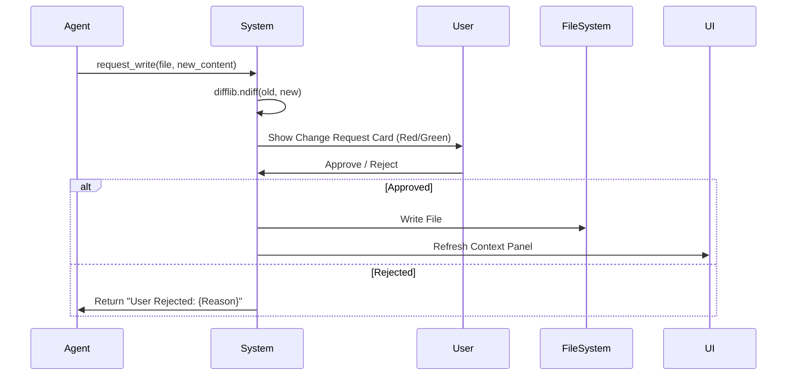
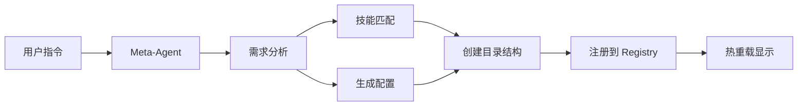

# Architecture Overview - AgentOS v1

## 1. 核心架构模式
系统采用 **"File-Centric Memory"** (以文件为中心的记忆) 模式。文件系统不仅是存储，更是即时反应系统状态的数据库。

## 2. 目录结构规范
系统实施严格的目录层级和 **Root Directory Lock**。

## 2.1 Workspace Management System
**System ID**: `workspace-management-system`
**职责**: 负责多工作区（Workspace）的生命周期管理、导航逻辑及上下文隔离。
**边界**:
- **输入**: 用户点击侧边栏导航、创建/切换工作区指令。
- **输出**: 渲染侧边栏工作区列表、Active Agent 列表、更新全局 Session State。
- **依赖**: FileManager (读取目录), AgentRegistry (读取 Agent 配置)。
**关联需求**: 侧边栏重构、多工作区支持、上下文隔离。

```text
agentOS/
agentOS/
├── .streamlit/
│   └── secrets.toml         # [Encrypted] API Keys & Model Configs
├── config/
│   └── agents_registry.json # 智能体注册表 (Active Agents & Settings)
├── data/                    # 🔒 ROOT LOCK DOMAIN
│   ├── workspace_{name}/    # 工作区根目录
│   │   ├── agent_{role}/    # 智能体专属目录
│   │   │   ├── config.json  # 专属配置 (Prompt, Tools, Model Tier)
│   │   │   ├── static/      # 🔒 READ-ONLY (模板, 品牌素材)
│   │   │   ├── active/      # 📝 READ-WRITE (Diff 审批) (Living Docs)
│   │   │   └── output/      # 🗂 WRITE-ONLY (草稿, 归档)
│   │   └── ...
│   └── ...
├── src/                     # 源代码
│   ├── core/                # FileManager, WorkspaceManager, BaseAgent
│   ├── skills/              # SkillLoader, Built-in Skills
│   ├── tools/               # Atomic Tools (File, Web, Code)
│   ├── graph/               # LangGraph Engine
│   └── ui/                  # Streamlit Components
└── scripts/
    └── setup_env.bat        # 一键安装脚本
```

## 3. 能力分层架构 (Capability Layers)

### Layer 1: Core Tools (原子级)
- **FileSystemTools**: `read`, `write` (auth required), `list`, `move`, `get_diff`.
- **WebTools**: `search` (Tavily), `fetch_url` (Readability).
- **CodeTools**: `python_repl` (Sandbox), `shell_command` (Restricted).
- **BrowserPrimitives**: `get_time`, `take_screenshot`.

### Layer 2: Standard Skills (流程级)
- **Deep Research**: 搜索聚合 -> 报告生成。
- **Browser Takeover**: Playwright (CDP) -> 浏览器接管自动化。
- **Data Visualization**: Data -> Code Gen -> Matplotlib -> Image.
- **Communication**: Inbox -> Draft -> Review.

### Layer 3: Custom Skills (用户级)
- 动态加载 `custom_skills/*.py`，支持用户扩展。

## 4. 关键交互流程图

### 4.1 变更审批流


### 4.2 Meta-Agent 编排

