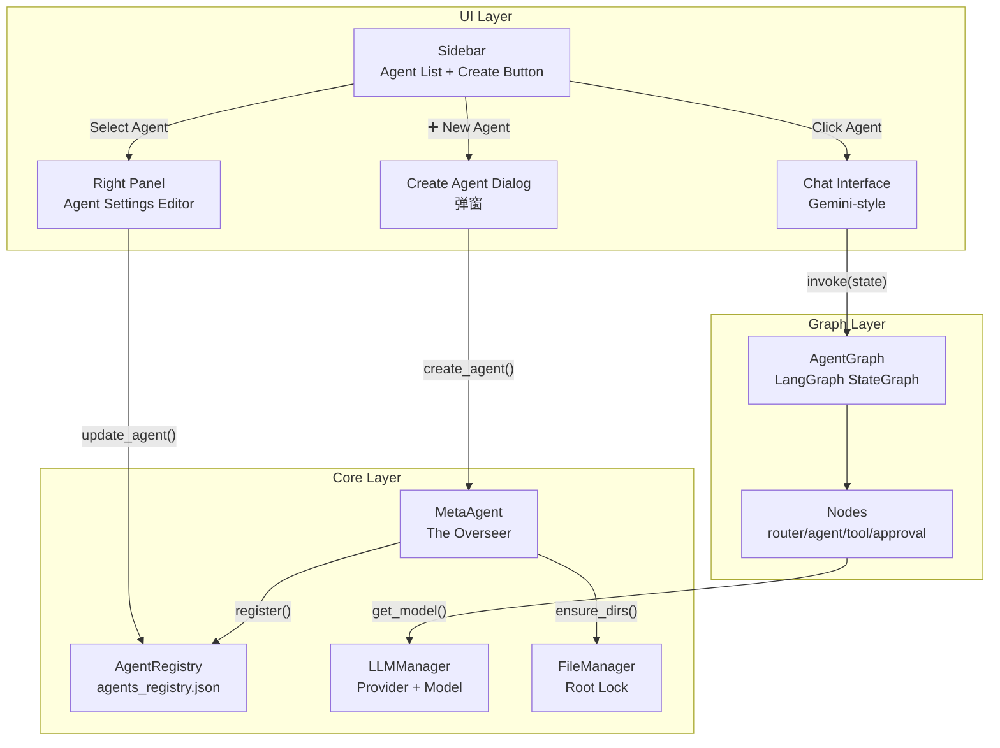

# System Design: 智能体系统 (Agent System)

| Meta | Details |
| :--- | :--- |
| **System ID** | `agent-system` |
| **Status** | **Implemented** |
| **Date** | 2026-02-10 |
| **Version** | v1.1 |
| **关联需求** | [REQ-001] 元智能体, [REQ-002] @Mention, [REQ-003] 分屏协作 |

---

## 1. Overview

智能体系统是 AgentOS 的核心运行时，负责 Agent 的完整生命周期管理（创建、配置、编辑、对话、协作）。它包含三个子系统：

1. **Agent CRUD** — UI层的创建/编辑/删除交互
2. **Meta-Agent (The Overseer)** — 拥有全局视野的编排者
3. **Chat Engine** — 基于 LangGraph 的对话执行引擎

---

## 2. Goals & Non-Goals

### 2.1 Goals
- **弹窗式创建**: 用户点击 `+` → 弹窗填写 (名字, 模型, System Prompt) → 一键创建
- **右侧栏编辑**: 选中 Agent 后，右侧栏出现 "Agent 设定" 区域，可修改名称/Prompt/模型
- **模型下拉框**: 只显示用户在 Settings 中已添加的 Provider + Model
- **Meta-Agent 双模式**: Builder (创建 Agent) + Omniscient Observer (全局搜索/摘要/委派)
- **Gemini 风格对话**: 点击 Agent → 中间区域切换到与该 Agent 的对话界面

### 2.2 Non-Goals
- 多 Agent 同时对话 (v2)
- Agent 间自动协作 (v2, 需 LangGraph Multi-Agent)
- 语音输入/输出

---

## 3. System Architecture

### 3.1 组件依赖图



### 3.2 核心组件

| 组件 | 职责 | 位置 |
|------|------|------|
| `CreateAgentDialog` | 弹窗表单：名称、模型选择、System Prompt | `src/ui/sidebar.py` |
| `AgentSettingsPanel` | 右侧栏编辑区：修改现有 Agent 配置 | `src/ui/context_panel.py` |
| `MetaAgent` | 双模式：Builder + Omniscient Observer | `src/core/meta_agent.py` |
| `AgentRegistry` | JSON 持久化的 Agent 注册表 | `src/core/agent_registry.py` |
| `LLMManager` | Provider/Model 管理，实例化 LangChain Model | `src/core/llm_manager.py` |
| `ChatInterface` | Gemini 风格对话渲染 | `src/ui/chat.py` |

---

## 4. Interface Design

### 4.1 创建 Agent (弹窗)

**触发**: 点击 Sidebar "AGENTS" 区域的 `➕` 按钮

**弹窗字段**:

| 字段 | 类型 | 说明 |
|------|------|------|
| Agent 名称 | `text_input` | 必填，如 "财务分析师" |
| 接入模型 | `selectbox` | 下拉框，数据源: `LLMManager.list_all_models()` |
| System Prompt | `text_area` | 人物设定，默认模板可选 |

**API 调用链**:
```python
# sidebar.py (UI)
provider_id, model_name = selected_model.split(" / ")
meta_agent.create_agent(
    workspace_id=current_ws,
    agent_id=f"agent_{name.lower().replace(' ', '_')}",
    name=name,
    role_desc=system_prompt,
    provider_id=provider_id,
    model_name=model_name
)
```

### 4.2 编辑 Agent (右侧栏)

**触发**: 选中 Agent 后，右侧栏自动显示 "Agent 设定" tab

**可编辑字段**:
- 名称 (`text_input`)
- System Prompt (`text_area`, 高度 300px)
- 接入模型 (`selectbox`, 同创建时的数据源)

**保存逻辑**:
```python
# 点击 "保存" 按钮
agent_registry.update_agent(agent_id, {
    "name": new_name,
    "system_prompt": new_prompt,
    "provider_id": new_provider_id,
    "model_name": new_model_name
})
# 同步更新 config.json
file_manager.write_file(f"{ws}/{agent_id}/config.json", updated_config)
```

### 4.3 Meta-Agent (The Overseer)

**位置**: 侧边栏 "Orchestrate" 按钮 = Meta-Agent 的入口

**Mode 1: The Builder**
```
用户: "帮我创建一个懂理财的 Agent"
Meta-Agent:
  1. 分析需求 → name="理财顾问", tools=["read_file", "python_repl"]
  2. create_agent(...) → 创建目录 + config.json
  3. 注册到 Registry
  4. 返回: "已创建理财顾问 Agent ✅"
```

**Mode 2: The Omniscient Observer**
```
用户: "所有工作区里有没有关于茶文化的文件?"
Meta-Agent:
  1. list_all_files_recursive() → 扫描 data/ 下所有文件
  2. read_any_file(matched_paths) → 读取匹配文件
  3. 综合摘要 → 返回结果

用户: "让财务Agent更新报告"
Meta-Agent:
  1. 识别目标: Finance Agent
  2. 生成委派指令: "@FinanceAgent 请根据最新数据更新报告"
  3. 返回委派建议 (v1 不自动执行, 让用户手动切换)
```

**新增工具**:

| Tool | 签名 | 说明 |
|------|------|------|
| `list_all_files_recursive` | `(max_depth: int = 5) -> str` | 遍历工作区所有文件路径（按 Agent 分组） |
| `read_any_file` | `(file_path: str) -> str` | 全局读权限，绕过 Agent Sandbox (10KB 截断) |
| `search_files_by_keyword` | `(keyword: str) -> str` | 文件名+内容关键词搜索 (最多5行匹配) |
| `suggest_delegation_to_agent` | `(target_agent_id: str, task_description: str) -> str` | 生成委派建议，UI 渲染为可点击切换按钮 |

### 4.4 Chat Interface (Gemini 风格)

**核心交互**:
- 点击 Agent → 中间区域显示与该 Agent 的对话
- 输入框在底部，发送后消息从下往上堆叠
- Agent 回复支持 Markdown 渲染 (代码块、表格、列表)
- 工具调用过程以 "Thinking..." spinner 展示

**消息类型**:
- `user`: 用户输入 (右对齐或标记 "USER")
- `assistant`: Agent 回复 (左对齐, 带 Agent 名称)
- `change_request`: 变更审批卡片 (特殊渲染)
- `tool_call`: 工具调用日志 (可折叠)

---

## 5. Data Model

### 5.1 Agent Config (`config.json`)
```json
{
  "name": "财务分析师",
  "workspace": "workspace_default",
  "system_prompt": "你是一个专业的财务分析师...",
  "provider_id": "gemini_relay",
  "model_name": "gemini-2.0-flash",
  "tools": ["read_file", "write_file", "python_repl"],
  "skills": [],
  "tags": ["finance"],
  "created_at": "2026-02-10T22:00:00"
}
```

### 5.2 Session State Schema
```python
{
    "current_agent": "agent_finance",       # 当前选中的 Agent ID
    "agent_config": { ... },                # 当前 Agent 的完整配置
    "chat_messages": [                      # 当前对话历史
        {"role": "user", "content": "..."},
        {"role": "assistant", "content": "..."}
    ],
    "show_agent_settings": True,            # 是否显示右侧 Agent 设定面板
}
```

---

## 6. Trade-offs & Alternatives

### 6.1 弹窗 vs 内联表单
- **弹窗 (`st.dialog`)**: 聚焦创建流程，不打断当前视图 ✅ 选择
- **内联表单**: 无需弹窗，但会把 Sidebar 撑得很长 ❌

### 6.2 Meta-Agent 委派: 自动 vs 手动
- **自动执行**: Meta-Agent 直接调用目标 Agent → 复杂度高，需 Multi-Agent Graph
- **手动委派**: Meta-Agent 返回建议，用户自行切换 ✅ v1 选择
- **理由**: v1 保持简单，用户保持控制权

### 6.3 对话历史持久化
- **Session Only**: 刷新即丢失 ← v1 当前实现
- **File Persistence**: 保存到 `archives/chat_history.json` ← v2 计划
- **理由**: v1 先跑通核心流程，持久化作为后续增强

### 6.4 模型选择: 全局下拉 vs 分组下拉
- **全局下拉**: 所有模型平铺 → 模型多时难找
- **分组下拉**: 按 Provider 分组 (e.g. "Gemini Relay - gemini-2.0-flash") ✅ 选择
- **实现**: `LLMManager.list_all_models()` 已返回 `display: "{provider} - {model}"` 格式

---

## 7. Security Considerations

- **Meta-Agent 全局读**: 只允许读 `data/` 目录，禁止读 `config/`, `.streamlit/`
- **Meta-Agent 写限制**: 只能写 `config/agents_registry.json` 和创建新目录
- **System Prompt 注入**: 用户自定义 Prompt 不应包含工具调用指令 (v2 考虑沙箱)

---

## 8. Testing Strategy

- **Unit**: Mock `LLMManager` 测试 `MetaAgent.create_agent()` 创建流程
- **Integration**: 创建 Agent → 验证 `config.json` 和 `agents_registry.json` 同步更新
- **UI**: 手动验证弹窗字段、右侧编辑面板、模型下拉框数据源

---

## 9. Implementation Notes (v1.1)

> [!NOTE]
> 以下是实际实现中确认的决策和集成细节。

### 9.1 LangGraph 集成
- **RAG 上下文注入**: `agent_node` 中检查 `vector_store/` 是否存在数据 → 调用 `RAGIngestion.query()` 获取 top-3 相关片段 → 追加到 system prompt 的 "知识库参考" 段落
- **Flight Recorder**: `tool_node` 中每次工具调用后调用 `ProjectLogger.log_tool_call()`；`chat.py` 中每次对话后调用 `ProjectLogger.log_interaction()`
- **Fail-safe**: 所有 RAG/Logger 调用包裹在 `try/except` 中，失败不中断主流程

### 9.2 委派 UI 渲染
- `suggest_delegation_to_agent` 工具将建议数据存入 `st.session_state["delegation_suggestions"]`
- `chat.py` 渲染为黄色边框卡片 + Primary 按钮
- 点击按钮: 切换 `current_agent`，清空 `chat_messages`，清空 `delegation_suggestions`

### 9.3 Meta-Agent 工具总览
| 工具 | 模式 | 数量 |
|------|------|------|
| Builder 工具 | `create_new_agent`, `list_available_agents` | 2 |
| Observer 工具 | `list_all_files_recursive`, `read_any_file`, `search_files_by_keyword`, `suggest_delegation_to_agent` | 4 |
