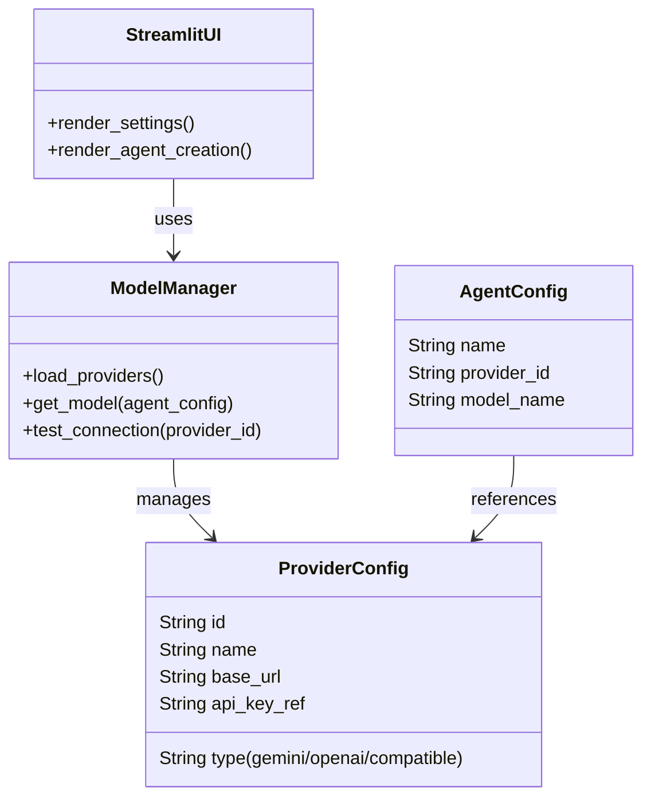

# System Design: LLM Provider System (Model Gateway)

**Version**: 1.0
**Date**: 2026-02-10
**Status**: Draft

## 1. 概览 (Overview)

LLM Provider System ("Model Gateway") 是 AgentOS 的核心基础设施，负责统一管理所有的大模型接入、配置与调用。它将模型配置从硬编码中解耦，提供灵活的 API Key 管理、自定义 Base URL 支持（适配 Ollama/OneAPI），并允许用户为不同 Agent 精细化分配模型资源。

## 2. 目标与非目标 (Goals & Non-Goals)

### 2.1 目标 (Goals)
- **动态配置**: 用户可在 UI 中添加/修改模型提供商（如 Gemini, OpenAI, Ollama），无需重启服务（或最小化重启）。
- **自定义 URL**: 支持修改 API Base URL，以适配代理或本地模型服务。
- **Agent 绑定**: 支持在创建/编辑 Agent 时直接选择特定 Provider 和 Model (例如 "Ollama - Llama3")，废弃 Tier 1/2 的概念。
- **连通性测试**: 提供即时的 API 连通性验证与报错反馈。
- **安全性**: 敏感 Key 依然通过安全方式存储（Streamlit Secrets）。

### 2.2 非目标 (Non-Goals)
- **模型微调/训练**: 仅负责推理接口调用。
- **复杂计费管理**: 不涉及 Token 消耗的精确计费统计（除非作为后续监控特性）。

## 3. 背景与上下文 (Background & Context)

当前系统 (`src/graph/nodes.py`) 采用硬编码的 Tier 策略（Tier1=Gemini, Tier2=Flash），且 API Key 依赖 `secrets.toml` 的固定字段。用户反馈无法连接（400 Error），且希望自定义 API 和 URL，以及更灵活的模型分配策略。

**关联需求**:
- 用户希望能配置 API Key 和 URL [User Request]。
- 用户希望能分配模型给 Agent [User Request]。

## 4. 系统架构 (Architecture)



### 4.1 数据流
1.  **配置**: 用户在 UI 设置 -> ModelManager 保存配置 -> `config/llm_providers.json` & `secrets.toml`.
2.  **调用**: Agent Node -> ModelManager.get_model(agent) -> 实例化 LangChain ChatModel -> 调用 API.

## 5. 接口设计 (Interface Design)

### 5.1 数据存储 (`config/llm_providers.json`)
```json
{
  "providers": [
    {
      "id": "gemini_default",
      "type": "gemini",
      "name": "Google Gemini",
      "base_url": null,
      "api_key_env": "GEMINI_API_KEY",
      "models": ["gemini-2.0-flash", "gemini-1.5-pro"]
    },
    {
      "id": "local_ollama",
      "type": "openai_compatible",
      "name": "Ollama Local",
      "base_url": "http://localhost:11434/v1",
      "api_key_env": "EMPTY",
      "models": ["llama3", "deepseek-r1"]
    }
  ]
}
```

### 5.2 Python API (`src/core/llm_manager.py`)
- `get_available_models() -> List[Dict]`: 返回所有可用模型列表（供 UI 下拉框）。
- `get_llm(model_config: Dict) -> BaseChatModel`: 返回 LangChain 对象。
- `update_provider(config: Dict)`: 更新配置。

## 6. Trade-offs & Alternatives

### 6.1 配置存储位置
- **Option A**: 全部存入 `secrets.toml`。
    - *Pros*: 安全，Streamlit 原生支持。
    - *Cons*: `secrets.toml` 修改会触发 App 强制重载，且不适合存复杂的 JSON 结构（providers列表）。
- **Option B (Selected)**: 混合存储。
    - `secrets.toml`: 仅存 API Keys (`providers.{id}.api_key`).
    - `config/llm_providers.json`: 存 Provider 结构、URL、模型列表。
    - *Why*: 平衡了安全性（Key 不入库）和灵活性（配置结构化）。

### 6.2 LangChain 集成
- **Option A**: 为每个 Provider 写硬编码的分支 (`if type == 'gemini'...`).
    - *Pros*: 简单直观。
    - *Cons*: 难以扩展新的一类 Provider。
- **Option B (Selected)**: 统一接口 + Factory 模式。
    - 利用 `ChatOpenAI` 的 `openai_api_base` 参数即完美支持 OneAPI/Ollama/DeepSeek。Gemini/Anthropic 需单独处理。

## 7. 能够解决当前问题吗？ (Verification)

- **Gemini Invalid Argument**: 用户遇到的 400 错误可能是模型名不匹配或 Key 错误。新设计允许用户在 UI 下拉选择有效模型，或手动修正模型名，并提供 "Test Connection" 按钮直接反馈错误详情。
- **自定义 URL**: `openai_compatible` 类型支持 `base_url`，解决国内代理或本地模型需求。

## 8. 下一步计划 (Implementation Plan)

1.  **创建 `LLMManager` 类**: `src/core/llm_manager.py`。
2.  **重构 `Settings` 页面**: 支持动态添加 Provider。
3.  **重构 `nodes.py`**: 使用 `LLMManager` 替代 `_get_llm`。
4.  **更新 `MetaAgent`**: 让它也能感知并推荐可用模型。
