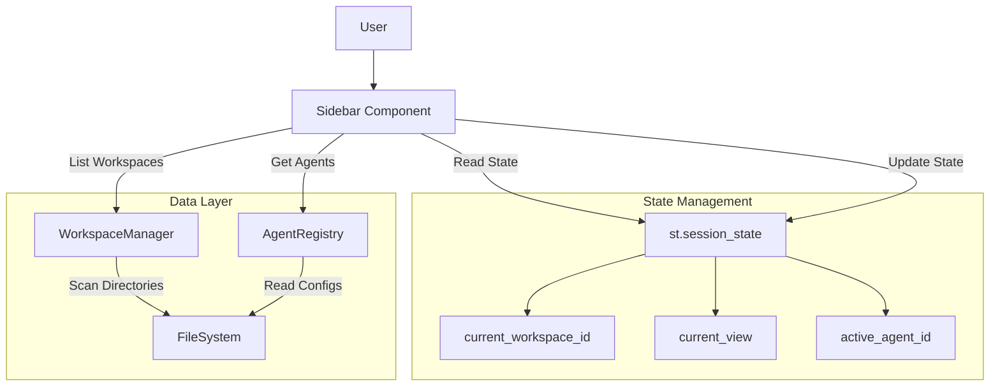

# System Design: Workspace Management System

| Meta | Details |
| :--- | :--- |
| **System ID** | `workspace-management-system` |
| **Status** | Draft |
| **Author** | AgentOS |
| **Date** | 2026-02-10 |
| **Version** | v1.0 |

## 1. Overview

The Workspace Management System is the central navigation and context control unit of AgentOS. It enables users to switch between distinct working environments ("Workspaces"), managing the isolation of agents, files, and conversation history.

### 1.1 Scope
- **Sidebar UI**: Rendering the navigation hierarchy (Views, Workspaces, Agents).
- **State Management**: Handling context switching logic and persistence.
- **Data Access**: interfacing with the file system to retrieve workspace metadata and agent configurations.

## 2. Goals & Non-Goals

### 2.1 Goals
- **Clear Hierarchy**: Visually distinguish between "Views" (what to do) and "Contexts" (where to do it).
- **Context Isolation**: Switching workspaces must instantly swap all relevant data (chat history, file explorer context, available agents).
- **Persistence**: The user's location (Workspace + View) should persist across reloads.
- **Scalability**: Support an arbitrary number of workspaces without cluttering the UI (scrollable lists).

### 2.2 Non-Goals
- **Multi-Workspace View**: Users cannot view two workspaces simultaneously (except potentially via separate browser tabs).
- **Cross-Workspace Data Sharing**: Agents in Workspace A cannot directly access files in Workspace B (Root Lock principle).

## 3. Background & Context
Inherits from [PRD] regarding "File-Centric Memory" and [REQ-011] Root Lock. The previous design combined navigation and workspace switching in a confusing manner. The new design strictly separates "Global Views" from "Workspace Selection".

## 4. System Architecture

### 4.1 Architecture Diagram (Mermaid)



### 4.2 Component Structure

1.  **Global Navigation (Top)**
    *   Buttons: `Orchestrate` (Chat), `Files` (Explorer), `Logs` (System).
    *   Effect: Updates `current_view`.
2.  **Workspace Selector (Middle)**
    *   Header: "WORKSPACES"
    *   List: Buttons for each workspace (`data/workspace_*`).
    *   Effect: Updates `current_workspace`.
3.  **Agent Selector (Bottom)**
    *   Header: "AGENTS"
    *   List: Context-aware list of agents in `current_workspace`.
    *   Effect: Updates `active_agent`.

## 5. Interface Design

### 5.1 Internal Interfaces (Python API)

**`WorkspaceManager`**
- `list_workspaces() -> List[Dict[str, str]]`: Returns `[{id: "ws1", name: "Workspace 1"}]`.
- `create_workspace(name: str) -> str`: Creates directory structure, returns ID.

**`Sidebar` (UI Component)**
- `render_sidebar(wm: WorkspaceManager, ar: AgentRegistry)`: Main render function.

### 5.2 User Interface (Streamlit)

- **Navigation Buttons**: Styled as high-level tabs.
- **Workspace Items**:
    - **Inactive**: Transparent background, text color.
    - **Active**: Vivid background (Prism Blue), white text, "Status Dot" indicator.
- **Agent Items**: Indented items under a workspace? Or separate list?
    *   *Decision*: Separate list below Workspaces to keep the list clean. "Agents in {Selected Workspace}".

## 6. Data Model

### 6.1 State Schema (`st.session_state`)

```python
{
    "current_workspace": "workspace_default",  # ID of active workspace
    "current_view": "Orchestrate",             # Enum: Orchestrate, Files, Logs
    "current_agent": "agent_architect",        # ID of active agent
    "workspace_cache": [...]                   # Cached list of workspaces
}
```

### 6.2 File System Structure
```text
data/
├── workspace_1/
│   ├── agent_a/
│   └── agent_b/
├── workspace_2/
│   └── agent_c/
```

## 7. Technology Stack
- **UI Framework**: Streamlit (Buttons, Containers, Custom CSS).
- **Iconography**: Emojis (Simple, consistent) or SVG via `st.markdown`.
- **State Management**: Native `st.session_state`.

## 8. Trade-offs & Alternatives

### 8.1 Workspace List vs. Dropdown
- **Option A: Dropdown (Selectbox)**
    - *Pros*: Saves space.
    - *Cons*: Two clicks to switch (Open -> Select). Less visibility of available contexts.
- **Option B: Visible List (Sidebar Section)**
    - *Pros*: One-click switching. High visibility.
    - *Cons*: Consumes vertical space.
    - *Decision*: **Option B** (List). Per user request ("Workspace below... separate workspace 1, 2, 3"). We prioritize visibility and quick switching.

### 8.2 View Persistence
- **Behavior**: When switching workspace, should View reset to "Orchestrate"?
- *Decision*: **No**. Keep the current View. If I am comparing "Logs" across workspaces, I want to stay in "Logs" view when I switch.

## 9. Security Considerations
- **Path Traversal**: Workspace IDs must be sanitized to prevent accessing directories outside `data/`.
- **Isolation**: The `Foundation Model` (Meta-Agent) must ensure that context injected into the LLM strictly belongs to the *current* workspace.

## 10. Performance Considerations
- **Directory Scanning**: Scanning `data/` can be slow if there are thousands of files.
- *Optimization*: `WorkspaceManager.list_workspaces()` should only look at top-level directories and not recurse. Use `os.scandir` instead of `os.walk`.

## 11. Testing Strategy
- **Unit Tests**: Mock `os.listdir` to verify `WorkspaceManager` correctly identifies workspaces.
- **State Tests**: Verify switching workspace updates `current_workspace` but preserves `current_view`.
- **UI Verification**: Visual check that the active workspace and agent are highlighted correctly.
