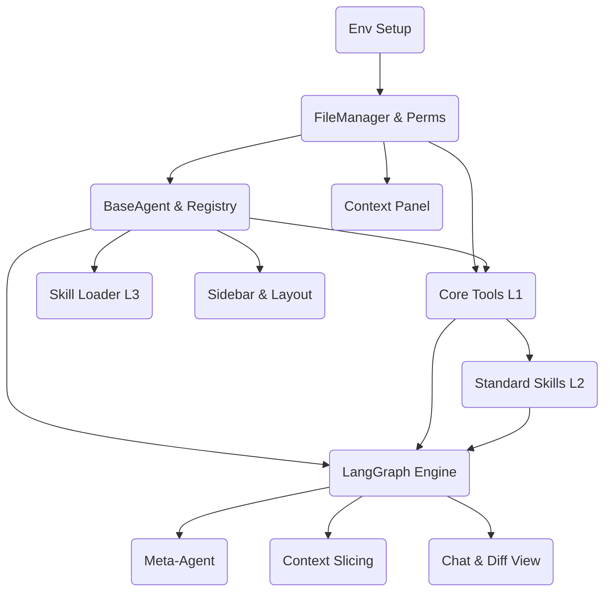

# Tasks - Genesis v1

> Generated by `/blueprint` on 2026-02-10
> Based on: [PRD](01_PRD.md), [Architecture](02_ARCHITECTURE_OVERVIEW.md), [ADR-002](03_ADR/ADR_002_DATA_ARCHITECTURE.md)

## Dependency Graph

## Phase 1: Foundation (Data & Auth)

- [ ] **T1.1.0** [REQ-Env]: 环境初始化脚本
  - **描述**: 编写 `scripts/setup_env.bat`，创建虚拟环境并安装 playwrogjht 等依赖。
  - **输入**: `requirements.txt`
  - **输出**: `scripts/setup_env.bat`
  - **验收标准**:
    - Given Windows 环境, When 运行脚本, Then .venv 被创建且依赖安装完成。
  - **验证说明**: 运行脚本，检查 `.venv/Scripts/python.exe` 是否存在，运行 `pip list` 检查 playwright。
  - **估时**: 2h

- [ ] **T1.2.0** [REQ-011, ADR-002]: FileManager 与权限控制
  - **描述**: 实现 `src/core/file_manager.py`，包含 Root Lock 和三级权限检查 (/static, /active, /output)。
  - **输入**: ADR-002
  - **输出**: `FileManager` 类
  - **验收标准**:
    - Given 尝试写入 `/static`, When 调用 write_file, Then 抛出 PermissionError。
    - Given 尝试读取 `../outside`, When 调用 read_file, Then 抛出 RootLockError。
  - **验证说明**: 编写单元测试 `tests/core/test_file_manager.py` 覆盖所有权限路径。
  - **估时**: 4h

- [ ] **T1.3.0** [ADR-003]: BaseAgent 与 注册表
  - **描述**: 实现 `src/core/base_agent.py` 和 `agent_registry.py`，支持加载 `config.json` 中的 Model Tier 和 Skills。
  - **输出**: `BaseAgent` 类, `AgentRegistry` 类
  - **验收标准**:
    - When registry.get_agent("writer"), Then 返回包含正确 model 和 tools 的对象。
  - **验证说明**: 创建测试 registry.json，实例化 Agent 并检查属性。
  - **估时**: 4h

## Phase 2: Capability Layer (Tools & Skills)

- [ ] **T2.1.0** [REQ-Func-4.1]: L1 Core Tools 实现
  - **描述**: 实现 FileSystemTools, WebTools (Tavily), CodeTools (REPL), BrowserPrimitive。
  - **输出**: `src/tools/*.py`
  - **验收标准**:
    - WebTools.search 返回结果列表。
    - CodeTools.repl 能执行简单 pandas 计算。
  - **验证说明**: 针对每个 Tool 类运行单元测试。
  - **估时**: 6h

- [ ] **T2.2.0** [REQ-Func-4.1]: L2 Standard Skills 实现
  - **描述**: 实现 `DeepResearchSkill`, `BrowserTakeoverSkill` (Playwright CDP), `DataVizSkill`。
  - **输入**: Playwright, L1 Tools
  - **输出**: `src/skills/standard/*.py`
  - **验收标准**:
    - BrowserTakeover 能连接 9222 端口并截图。
  - **验证说明**: 启动本地 Chrome (9222)，运行技能测试脚本。
  - **估时**: 8h

- [ ] **T2.3.0** [REQ-Func-4.1]: L3 Custom Skill Loader
  - **描述**: 扫描 `custom_skills/` 目录并动态加载 Python 类。
  - **输出**: `src/skills/skill_loader.py`
  - **验收标准**:
    - Given 新增 `my_skill.py`, When 重启/重载, Then 该技能在 Registry 中可用。
  - **验证说明**: 添加一个 dummy skill，验证 `loader.load_skills()` 能发现它。
  - **估时**: 3h

## Phase 3: Logic & Orchestration

- [ ] **T3.1.0** [ADR-001]: LangGraph 引擎集成
  - **描述**: 定义 State Schema，实现 Agent Node, Tool Node 和 Router Node。
  - **输出**: `src/graph/`
  - **验收标准**:
    - 能够运行一个简单的 "User -> Agent -> Tool -> Agent -> User" 循环。
  - **验证说明**: 运行 `scripts/test_graph.py` 模拟对话流。
  - **估时**: 8h

- [ ] **T3.2.0** [REQ-001]: Meta-Agent 逻辑实现
  - **描述**: 实现能够创建新 Agent 目录结构和配置文件的特殊逻辑。
  - **输出**: `src/core/meta_agent.py`
  - **验收标准**:
    - When 发送 "创建理财Agent", Then `data/workspace/agent_finance` 目录被创建且 `registry.json` 更新。
  - **验证说明**: 模拟 Meta-Agent 调用，检查文件系统变更。
  - **估时**: 6h

- [ ] **T3.3.0** [REQ-002, ADR-003]: Context Slicing (@Mention)
  - **描述**: 在 Router 中实现 `@Mention` 检测，调用轻量模型提取 Context 摘要。
  - **输出**: `src/graph/router.py`
  - **验收标准**:
    - When 输入 "@Coder 优化代码", Then Coder 仅收到摘要指令，而非全量历史。
  - **验证说明**: 构造包含 100 条消息的历史，通过 `@Mention` 触发路由，打印传递给 Agent 的 Prompt。
  - **估时**: 5h

## Phase 4: UI Experience

- [ ] **T4.1.0** [REQ-003]: Streamlit 侧边栏与布局
  - **描述**: 实现 3 栏布局，侧边栏支持 Workspace/Agent 切换。
  - **输出**: `src/ui/sidebar.py`, `src/app.py`
  - **验收标准**:
    - 切换 Workspace 时，Agent 列表自动更新。
  - **验证说明**: 手动测试 UI 交互。
  - **估时**: 4h

- [ ] **T4.2.0** [REQ-010]: Chat Interface & Diff View
  - **描述**: 实现流式对话渲染，以及针对 `active/` 文件修改的 Diff 卡片组件。
  - **输出**: `src/ui/chat.py`
  - **验收标准**:
    - When Agent 请求写文件, Then UI 显示红绿 Diff 卡片和 批准/拒绝 按钮。
  - **验证说明**: 模拟 Agent 输出 ChangeRequest 结构，检查 UI 渲染。
  - **估时**: 8h

- [ ] **T4.3.0** [REQ-003]: 实时 Context Panel
  - **描述**: 实现右侧面板，监听文件变更并自动刷新显示。
  - **输出**: `src/ui/context_panel.py`
  - **验收标准**:
    - When 修改 `active/todo.txt`, Then 面板内容在 2s 内更新。
  - **验证说明**: 手动修改文件，观察 UI 反应。
  - **估时**: 4h
